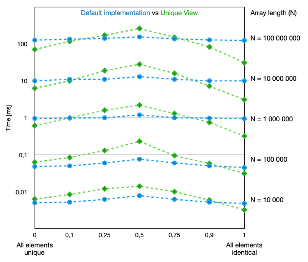

# UniqueView

An alternative algorithm for std::unique that provides an iterable view of the unique slices.

## Motivation

Complexity of algorithms is typically expressed in _N_, the length of the array. For the STL's `unique` algorithm, that is _O(N)_, linear in the length of the array, because it requires

> (_N_ - 1) comparisons.

However, the complexity also depends on the elements itself. When considering non-empty arrays (_N_ > 0) with _U_ unique elements (1 < _U_ <= _N_), the default implementation also incurs

> (_U_ - 1) element moves

This can be seen clearly in a worst-case sequence **1,1**,2,3,4,5,6,7,8,9: because of the duplicate element 1, all subsequent elements are moved up one place. This cost is what this view approach is focussing on.

## View approach

In this alternative implementation, the input array remains unchanged. Instead, a iteratable `UniqueView` is created for the unique elements. This consist of slices of iterators into the array that together comprise the unique elements,

     1, 1, 2, 3, 4, 5, 6, 7, 8, 9
    \_/    \____________________/
     |               |
     First slice     Second slice

`UniqueView` provides an iterator that goes through all elements for each slice. This way the unique elements can be used as expected, without the need for moving them.

Example:

    const UniqueView uniqueView(input);
    const auto sumUniqueElements = std::accumulate(uniqueView.begin(), uniqueView.end(), 0);

### Preliminary timings

**Disclaimer**: this are timings for a proof of concept implementation of this alternative algorithm. Purpose of these timings is to show then this view approach is viable an can be faster for certain sequences.

For varying numbers of unique elements ranging from all identical to all identical, the time for creating the unique sequence and summing the unique elements was compared between STL baseline and `UniqueView`:

## Parallel implementation

Whilst for certain arrays, this view approach can be faster than the default implementation in a serial context, it is expected that this is even more pronounced in a parallel setting.

A typical parallel approach divides the array in chunks that are processed in parallel using the default sequential `unique` implementation. Afterwards, a second pass is required to combine the unique parts of each chunk. As this has to be done either sequentially or requires an additional work array, the cost of moving the elements might take a significant portion of the execution time.

If one would implement the unique view approach in parallel, the second pass only consists of merging the unique slices.

Please contact me if you want to discuss this in more details.

## Credits

This work was inspired by "ADSP: The Podcast" episode [145](https://adspthepodcast.com/2023/09/01/Episode-145.html) and [147](https://adspthepodcast.com/2023/09/15/Episode-147.html) where NVIDIA CUB's `unique` implementation was discussed and the listener was challenged to avoid the additional work array for a parallel version of this algorithm.
